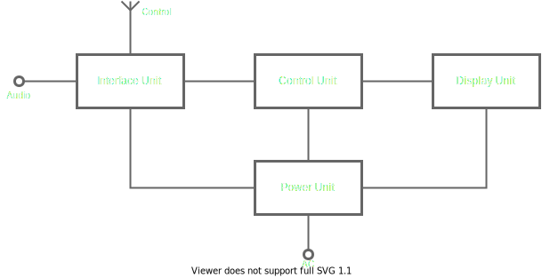

# LED brick

## Goals 

This device creating just for fun :-)

Also, I want to check my skills in electronics.

## Description
The device gives a lot of fun and relaxation by watching full-coloured blinkenlights.

## Architecture
The structure of the device is based on the next principles:
1. responsibility separation - a unit performs some whole functions with minimal  other units involving,
2. low coherence - a unit communicates with other units as low as possible for functions realisation.

The device consists of the next units (see Fig.1):
1. Interface unit (IU)
2. Control unit (CU)
3. Display unit (DU)
4. Power unit (PU)

### Interface unit

The unit main functions are signals transformation from control and audio interfaces to an internal interface and vice versa.
Also, the one translates an analogue audio signal in a digital form.

This one has two external channels:
1. A 'Control channel' are a bi-directional radio link, that is released by WiFi and Bluetooth Low Energy technology. The channel is used for receiving a command from remote devices like smartphones, desktops, etc.
2. An 'Audio channel' is an only-input channel. The channel is used for synchronising dynamical characteristics of an image on the Display Unit, say, brightness, colour, or rhythm.

The unit has an internal connection with the Control Unit for sending control and audio signals in a digital form.

### Control unit

The unit main functions are generating images based on predefined algorithms and audio signals. Moreover, the unit calibrates an element lightness in the Display Unit and watches for failures in the Display Unit.

The unit has internal connections with other units:
1. with the Interface Unit for receiving control and audio signals in digital form.
2. with the Display Unit for controlling the show and health-checking of LEDs.

### Display unit

The unit shows awesome images :-)
This unit is a set of three-coloured LEDs organized in a parallelepiped with sides 8 x 8 x 32.

### Power unit

Just the power supply unit for the other units.

## Roadmap
### Prototyping Phase
#### Version 0.1
##### Purposes
##### Functions
##### Hardware

#### Version 0.2
##### Purposes
##### Functions
##### Hardware

#### Version 0.3
##### Purposes
##### Functions
##### Hardware

#### Version 0.4
##### Purposes
##### Functions
##### Hardware

### Release Candidate Phase
This phase will be defined after the Prototyping Phase
### Release Phase
This phase will be defined after the Release Candidate  Phase